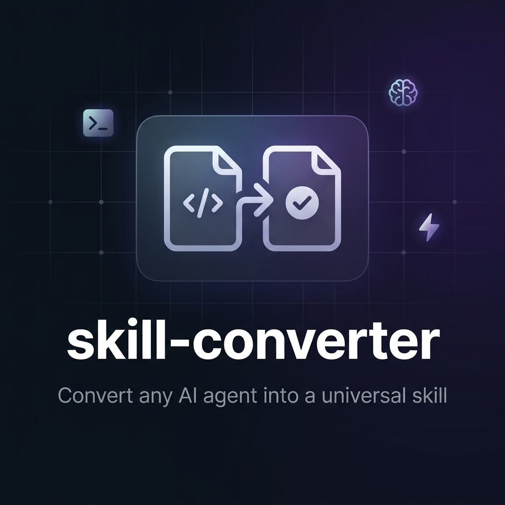

<p align="center">
  
</p>

<h1 align="center">skill-converter</h1>

<p align="center">
  <strong>Convert any AI agent or skill file into a universal skill — works with every AI coding tool.</strong>
</p>

<p align="center">
  <a href="#installation"></a>
  <a href="https://github.com/lordpardonme/skill-converter/stargazers"></a>
  <a href="https://github.com/lordpardonme/skill-converter/blob/main/LICENSE"></a>
  <a href="#supported-tools"></a>
</p>

<br />

---

## 🤔 The Problem

You find an amazing Claude Code agent on GitHub. You try to use it... but you're on **Cursor**. Or **Antigravity**. Or **Codex**.

Every AI tool has its own skill format. Different frontmatter. Different folder paths. Different conventions. So that great skill you found? **Useless** — unless you manually rewrite it.

## ✨ The Solution

**skill-converter** is an AI skill that converts _any_ agent or skill file into _your_ tool's format. Automatically.

- 📥 **Input**: Claude Code agent, Cursor rule, GitHub link, raw markdown — anything
- 🔄 **Process**: Extracts every detail (methodology, workflows, rules, examples, anti-patterns)
- 📤 **Output**: A properly formatted `.md` skill file for your specific tool

Works with **any domain** — design, marketing, frontend, backend, DevOps, writing, whatever.

---

## 🛠 Supported Tools

| Tool | Format | Output Path |
|------|--------|-------------|
| **Antigravity** | `name` + `description` frontmatter | `.agents/skills/<name>/SKILL.md` |
| **Claude Code** | `name` + `description` + `tools` frontmatter | `.claude/agents/<name>.md` |
| **Cursor** | `description` + `globs` frontmatter | `.cursor/rules/<name>.mdc` |
| **Codex** | Plain markdown | `.codex/<name>.md` |
| **Zed** | Plain markdown | `.zed/instructions/<name>.md` |
| **Other** | Generic format | `skills/<name>/SKILL.md` |

> Don't see your tool? skill-converter uses a generic format and tells you what to adjust.

---

## 📦 Installation

### Option 1: Full install (recommended)

```bash
npx skill-converter@latest
```

This will:
1. Ask what AI tool you're using
2. Download and install the **complete skill** (with full methodology) into the correct folder
3. You're ready to go

> ⚡ This is the only way to get the full conversion engine with format maps, extraction logic, and decision trees.

### Option 2: Lite version (manual)

Clone this repo for the lite version:

```bash
# Clone
git clone https://github.com/lordpardonme/skill-converter.git

# For Antigravity — copy to skills folder
cp -r skill-converter/ .agents/skills/skill-converter/

# For Claude Code — copy SKILL.md as an agent
cp skill-converter/SKILL.md .claude/agents/skill-converter.md

# For Cursor — copy as a rule
cp skill-converter/SKILL.md .cursor/rules/skill-converter.mdc
```

> ⚠️ The lite version includes the workflow but not the full format specifications. For the complete experience, use Option 1.

---

## 🚀 Usage

Once installed, just talk to your AI agent naturally:

```
"Convert this Claude agent into a skill I can use here"
```

```
"I have this GitHub link to a Cursor rule, turn it into an Antigravity skill"
```

```
"Here's a skill file — convert it for Codex"
```

### What happens:

1. **The skill asks your target tool** — "What AI tool are you converting to?"
2. **You share the source** — paste content, give a GitHub link, or attach a file
3. **It extracts everything** — philosophy, workflows, rules, examples, anti-patterns, references
4. **It converts** — outputs a properly formatted `.md` skill for your tool
5. **It writes the files** — saves to the correct folder on your machine

### Example: Converting a Claude Code agent → Antigravity skill

**You say:**
> "Convert this Claude agent into an Antigravity skill"

**You paste:**
> _(the Claude Code agent `.md` content)_

**skill-converter outputs:**
```
✅ Converted: ui-ux-designer

Files created:
  .agents/skills/ui-ux-designer/SKILL.md       (97 lines — core workflow)
  .agents/skills/ui-ux-designer/REFERENCE.md    (280 lines — full methodology)

Summary: Senior UI/UX design critic with evidence-based audits using
NN Group research and WCAG accessibility standards.
```

---

## 📁 What's Inside

```
skill-converter/
├── SKILL.md           # Lite version — workflow, triggers, rules
├── assets/
│   └── banner.png     # Repo banner
├── LICENSE            # CC BY 4.0
└── README.md          # You're reading this
```

### SKILL.md (Public — Lite)

The public skill file. Contains:
- **Trigger conditions** — when should the converter activate
- **6-step workflow** — ask tool → get source → extract → convert → present → write
- **Rules** — never assume target, never skip extraction, always split large skills

### Full Methodology (via `npx` install only)

The complete conversion engine — available only through the CLI install. Includes:
- **Format maps** for every supported tool (exact frontmatter, folder paths)
- **Description writing rules** — how to write trigger-friendly descriptions
- **Extraction checklist** — what to pull from every source file
- **Output decision tree** — when to split files, how to handle unknown tools
- **Common source formats** — how to identify Claude agents, Cursor rules, etc.

---

## 🔄 What Can Be Converted?

**Any skill, from any domain:**

| Domain | Example |
|--------|---------|
| 🎨 Design | UI/UX audit skills, design system generators |
| 💻 Frontend | React patterns, animation systems, CSS methodologies |
| ⚙️ Backend | API design skills, database optimization agents |
| 📱 Mobile | Flutter skills, React Native agents |
| 🔒 Security | Code review agents, vulnerability scanners |
| ✍️ Writing | Documentation skills, copywriting agents |
| 📊 Marketing | SEO skills, content strategy agents |
| 🏗️ DevOps | CI/CD skills, deployment agents |
| 🧪 Testing | TDD skills, QA automation agents |

**From any source format:**

- Claude Code agents (`.claude/agents/*.md`)
- Cursor rules (`.cursor/rules/*.mdc`)
- Antigravity skills (`SKILL.md` + `REFERENCE.md`)
- Zed instructions (`.zed/instructions/*.md`)
- Raw markdown files
- GitHub links (raw or regular)
- Pasted content

---

## 🧠 Why This Exists

The AI coding tool ecosystem is fragmented. Great skills get locked into one tool's format. Developers shouldn't have to manually rewrite methodology files just because they switched from Claude Code to Cursor, or from Cursor to Antigravity.

**skill-converter** makes every skill portable.

---

## 🤝 Contributing

Found a tool format we don't support? Open an issue or PR with:
1. The tool name
2. Expected frontmatter format
3. Expected file path
4. Any quirks (file extension, naming conventions, etc.)

---

## 📄 License & Attribution

**CC BY 4.0** — you're free to use, copy, fork, and build on this. One rule:

> **You must credit the original author.**

If you copy this skill, fork the repo, or create a derivative:

1. Keep the attribution line in `SKILL.md` (it's at the bottom)
2. Link back to this repo: `https://github.com/lordpardonme/skill-converter`
3. State if you made changes

Removing the attribution notice violates the license.

Full license: [CC BY 4.0](https://creativecommons.org/licenses/by/4.0/)

---

<p align="center">
  <strong>Built by <a href="https://github.com/lordpardonme">@lordpardonme</a></strong>
  <br />
  <sub>Stop rewriting skills. Start converting them.</sub>
</p>
